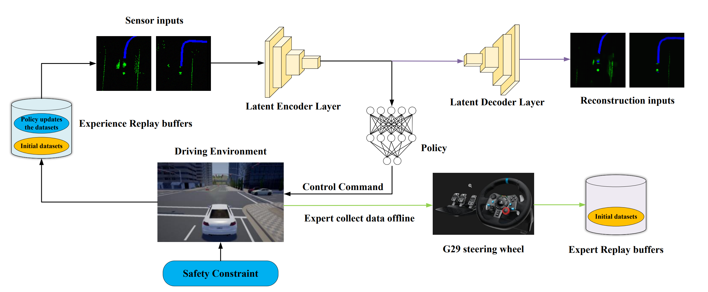

EGADS: Efficient and Generalized end-to-end Autonomous Driving System with Latent Deep Reinforcement Learning and Demonstrations (ECML PKDD 2025)
======
[](LICENSE.md) [](https://www.python.org/downloads/release/python-380/)
## 🏷️ Overview of the EGADS (Finding our [paper](https://arxiv.org/abs/2401.11792) and [project website](https://sites.google.com/view/sgads-proj/sgads) )


Our EGADS framework effectively enhances sample efficiency, safety, and generalization in autonomous driving systems. The inclusion of safety constraints significantly enhances vehicle safety. NFRL, our proposed method, accurately predicts future driving actions, reducing sample complexity. By fine-tuning with a small amount of expert data, NFRL agents learn more general driving principles, which greatly improve generalization and sample complexity reduction, offering valuable insights for autonomous driving system design.

## 🏷️ RL agent in the latent space

(a) RL agent learns potential dynamics from past experience datasets. (b) RL agent predicts driving action in an imaginary space. (c) RL agent interacts with driving environment. Where $o$ is observation, $a$ is action, $s$ is latent state, $\hat{r}_{t}$ is reward, $\hat{o}_t$ is reconstructed and $\hat{v}_{t}$ is value.


## 1.Installation  env

* Run following command

`$ conda env create -f conda_env.yaml` 

`$ source activate dreamer`

## 2.Installation CARLA
* An NVIDIA RTX 3090 GPU, python 3.8
* Based on Ubuntu 16.04 or 18.04

    `$ cd $yourfolder$/gym-carla-master`

    `$ pip install -r requirements.txt`

    `$ pip install -e .`

* Download  [CARLA_0.9.10](https://github.com/carla-simulator/carla/releases)

    `$ export PYTHONPATH=$PYTHONPATH:$YourFolder$/CARLA_0.9.10/PythonAPI/carla/dist/carla-0.9.10-py3.7-linux-x86_64.egg`

## 3.Usage
* Enter the CARLA root folder and launch the CARLA server by:

    `$ ./CarlaUE4.sh -opengl -carla-port=2000`
* You also have the option to modify other configuration parameters of the environment in the `env_carla_obschannel.py` file.
## 4.Training 

* You can run `python main_dreamer.py --id name-of-experiement `

* You can run `tensorboard --logdir results`
## 5.Evaluating 

* Running it `python main_dreamer.py --id name-of-experiement --test True --models your training models`

## 6.References
If you find this open source or paper release useful, please reference in your paper:
```
@article{tang2024efficient,
  title={Efficient and generalized end-to-end autonomous driving system with latent deep reinforcement learning and demonstrations},
  author={Tang, Zuojin and Chen, Xiaoyu and Li, YongQiang and Chen, Jianyu},
  journal={arXiv preprint arXiv:2401.11792},
  year={2024}
}
```


G29 expert datasets
===================================
[](LICENSE.md) 

* Overview:
we establish a connection between the Logitech G29 steering wheel and the CARLA, and then human expert can collect the datasets of teaching via the G29 steering wheel. Specifically, we linearly map
accelerator pedals, brake pedals, and turning angles into accel (0,3), brake (-8,0),
steer(-1,1)(left,right). The tensors are written into user-built Python scripts and combined with
CARLA built-in Python API so that users can provide input from their steering wheels to autonomous
driving cars in CARLA simulator for expert collection.

* This is an anonymous URL link to this  [G29 expert datasets](https://drive.google.com/file/d/1BlvNoooE0BDSWf1lTY-Pq16_L70Vhxm9/view?usp=sharing) 
* You can use it: 
`python main_dreamer.py --id name-of-experiement --experience-replay G29 expert datasets`
* For collecting expert datasets with Logitech G29 steering wheel, please refer to the repo [Logitech G29 steering wheel connects to CARLA](https://github.com/Markzjtang/Logitech-G29-connects-to-CARLA)
